# Sorting Core

This package is the ownership boundary for the sorting core. Sorting code should move here when it is independent of Fabric, NeoForge, Minecraft screens, networking, commands, and client click execution.

The core answers one question:

```text
Given stacks and sort settings, what should the final stack layout be?
```

It must not answer how that layout is applied. Server-side inventory mutation, client-side clicks, packets, commands, keybindings, and screen widgets are integration concerns.

## Sorting Flow

Sorting starts outside the core. A button, keybind, command, or packet decides that a sort should happen, identifies the inventory target, and checks whether sorting is allowed. From that point, the sorting core receives stack data and settings, computes the desired layout, and returns the result to the caller that knows how to apply it.

```mermaid
flowchart TD
    Trigger["Sort trigger"] --> TriggerKind{"What triggered sorting?"}

    TriggerKind -->|sort button| ExplicitTarget["Use button target<br/>CONTAINER or PLAYER_INVENTORY"]
    TriggerKind -->|packet| ExplicitTarget
    TriggerKind -->|player inventory command| PlayerCommandTarget["Use PLAYER_INVENTORY target"]
    TriggerKind -->|look-at-block command| LookAtBlock["Raycast up to lookup distance"]
    TriggerKind -->|keybind or double-click| ImplicitTarget["Choose target from current screen"]

    ImplicitTarget --> ContainerSortable{"Current menu can sort<br/>container slots?"}
    ContainerSortable -->|no| PlayerTarget["Use PLAYER_INVENTORY target"]
    ContainerSortable -->|yes| HighlightSetting{"Sort highlighted inventory<br/>setting enabled?"}
    HighlightSetting -->|no| ContainerTarget["Use CONTAINER target"]
    HighlightSetting -->|yes| HoveredSlot{"Hovered slot exists?"}
    HoveredSlot -->|no| ContainerTarget
    HoveredSlot -->|yes| HoveredPlayerSlot{"Hovered slot belongs to<br/>player inventory?"}
    HoveredPlayerSlot -->|yes| PlayerTarget
    HoveredPlayerSlot -->|no| ContainerTarget

    LookAtBlock --> HitBlock{"Block hit?"}
    HitBlock -->|no| Abort["Abort sort request"]
    HitBlock -->|yes| MenuProvider{"Block exposes menu?"}
    MenuProvider -->|no| Abort
    MenuProvider -->|yes| OpenTempMenu["Open temporary menu<br/>to inspect screen id"]
    OpenTempMenu --> TargetContainer{"Menu has sortable<br/>backing container?"}
    TargetContainer -->|no| Abort
    TargetContainer -->|yes| ContainerTarget

    ExplicitTarget --> SortTarget["Resolved SortTarget"]
    PlayerCommandTarget --> SortTarget
    PlayerTarget --> SortTarget
    ContainerTarget --> SortTarget

    SortTarget --> ExecutionPath{"Where will sorting execute?"}

    ExecutionPath -->|server support present| ServerPath["Send sort request to server<br/>or run command on server"]
    ExecutionPath -->|no server support| ClientPath["Use client fallback"]

    ServerPath --> ServerGate["Server checks menu validity,<br/>screen id, compatibility, and prevention settings"]
    ServerGate --> ServerTarget{"Resolved server target?"}
    ServerTarget -->|container| ServerSnapshot["Read target container slots"]
    ServerTarget -->|player inventory| ServerPlayerSnapshot["Read player main inventory slots"]
    ServerTarget -->|player inventory| HotbarBundleSetting{"Hotbar bundle targets<br/>setting enabled?"}
    HotbarBundleSetting -->|yes| HotbarBundleTargets["Read player hotbar slots<br/>as extra bundle targets"]
    HotbarBundleSetting -->|no| NoExtraBundleTargets["Use no extra bundle targets"]
    ServerGate --> ServerSettings["Read server-stored player settings<br/>with requested sort type"]

    ClientPath --> ClientGate["Client checks menu validity,<br/>spectator state, carried stack,<br/>slot activity, fake slots, and modification permission"]
    ClientGate --> ClientScope["Resolve sortable client slot scope<br/>container slots or player main inventory slots"]
    ClientScope --> ClientSnapshot["Read stacks from scoped client slots"]
    ClientScope --> ClientSettings["Read local client sort settings"]

    ServerSnapshot --> Snapshot["Layout snapshot"]
    ServerPlayerSnapshot --> Snapshot
    ClientSnapshot --> Snapshot
    HotbarBundleTargets --> ExtraBundleTargets["Extra bundle target snapshot"]
    NoExtraBundleTargets --> ExtraBundleTargets
    ClientSnapshot --> NoExtraBundleTargets
    ServerSnapshot --> NoExtraBundleTargets
    ServerSettings --> Settings["Sort settings"]
    ClientSettings --> Settings

    Settings --> RuleList["Read sort priority rule list<br/>from settings"]
    RuleList --> RuleRecord["For each rule:<br/>match text + position + list index"]
    RuleRecord --> ParseRule{"Parse match text"}
    ParseRule -->|valid| ExpressionTree["Build expression tree<br/>Interpreter"]
    ParseRule -->|invalid| DropRule["Drop invalid rule<br/>for runtime sorting"]
    ExpressionTree --> CompiledRules["Compiled rule:<br/>expression + position + list index"]
    DropRule --> CompiledRules

    Settings --> BundleSetting{"Sort into bundles<br/>setting enabled?"}
    Snapshot --> BundleSetting
    ExtraBundleTargets --> BundleSetting
    BundleSetting -->|no| OriginalSnapshot["Use original snapshot"]
    BundleSetting -->|yes| FindBundleTargets["Find bundle targets<br/>in layout snapshot plus<br/>extra bundle target snapshot"]
    FindBundleTargets --> ReadBundleContents["Read direct bundle contents<br/>using Minecraft bundle data"]
    ReadBundleContents --> BundleTargets{"Any non-full bundle<br/>with direct contents?"}
    BundleTargets -->|no| OriginalSnapshot
    BundleTargets -->|yes| BundleCandidates["Find loose stacks matching<br/>direct bundle contents"]
    CompiledRules --> BundleCandidates
    BundleCandidates --> IgnoreBundleCandidate{"Any IGNORE rule matches<br/>candidate stack?"}
    IgnoreBundleCandidate -->|yes| ExcludeBundleCandidate["Leave candidate in<br/>top-level snapshot"]
    IgnoreBundleCandidate -->|no| OrderBundleCandidates["Order bundle candidates<br/>by lowest stack count first"]
    OrderBundleCandidates --> InsertIntoBundles["Try insertion into matching bundles<br/>with Minecraft bundle rules"]
    InsertIntoBundles --> AdjustedSnapshot["Use layout snapshot adjusted by<br/>bundle insertion pass"]
    ExcludeBundleCandidate --> AdjustedSnapshot
    OriginalSnapshot --> BundleReady["Snapshot ready for<br/>top-level layout"]
    AdjustedSnapshot --> BundleReady

    BundleReady --> VisitStacks["Visit snapshot slots in order"]
    CompiledRules --> VisitStacks
    VisitStacks --> EmptySlot{"Slot empty?"}
    EmptySlot -->|yes| FillableSlot["Mark output position<br/>as fillable"]
    EmptySlot -->|no| IgnoreMatch{"Any IGNORE rule matches?"}

    IgnoreMatch -->|yes| KeepOriginal["Keep original stack<br/>fixed in this output position"]
    IgnoreMatch -->|no| SortableCopy["Copy stack into sortable pool"]
    SortableCopy --> MergeCandidate{"Can absorb prior compatible<br/>sortable stacks?"}
    MergeCandidate -->|yes| MergeStack["Move counts from compatible<br/>prior stacks into this candidate"]
    MergeStack --> RemoveEmptyMerged["Remove prior stacks<br/>emptied by the merge"]
    RemoveEmptyMerged --> AppendStack["Append candidate<br/>to sortable pool"]
    MergeCandidate -->|no| AppendStack
    AppendStack --> PoolReady
    FillableSlot --> OutputShape["Output shape has<br/>fixed slots and fillable positions"]
    KeepOriginal --> OutputShape

    PoolReady --> SortType["Read configured sort type"]
    SortType --> BaseOrdering{"Which base ordering<br/>strategy applies?"}
    BaseOrdering -->|name| NameOrder["Compare by sortable display name<br/>using configured language collator"]
    BaseOrdering -->|id| IdOrder["Compare by item identifier<br/>then default name ordering"]
    BaseOrdering -->|mod| ModOrder["Compare by item namespace<br/>then default name ordering"]
    BaseOrdering -->|category| CategoryOrder["Compare by creative tab order<br/>then default name ordering"]

    NameOrder --> BaseTieBreakers["Apply shared base tie-breakers<br/>ominous state, damage, count"]
    IdOrder --> BaseTieBreakers
    ModOrder --> BaseTieBreakers
    CategoryOrder --> BaseTieBreakers

    BaseTieBreakers --> PriorityCompare["For each sortable stack,<br/>compute priority key"]
    PriorityCompare --> PriorityMatch{"First non-IGNORE<br/>matching rule?"}
    PriorityMatch -->|yes| RuleBucket["Priority key:<br/>position bucket + rule list order"]
    PriorityMatch -->|no| DefaultBucket["Priority key:<br/>DEFAULT bucket + lowest precedence"]
    RuleBucket --> CombinedComparator["Combined comparison:<br/>priority key first, base ordering second"]
    DefaultBucket --> CombinedComparator
    CombinedComparator --> SortPool["Sort sortable pool"]

    OutputShape --> FillSlots["Fill empty output slots<br/>from sorted pool"]
    SortPool --> FillSlots
    FillSlots --> Layout["Return desired stack layout"]
    Layout --> ApplyPath{"Which execution path<br/>requested the layout?"}
    ApplyPath -->|server| ServerApply["Write desired stacks<br/>to server inventory slots"]
    ApplyPath -->|client fallback| ClickPlan["Compare current client slot state<br/>to desired layout"]
    ClickPlan --> Clicks{"Can vanilla clicks<br/>realize the layout?"}
    Clicks -->|no| Abort
    Clicks -->|yes| QueueClicks["Queue container clicks<br/>for later client ticks"]
```



The core owns the flow from `Snapshot` through `Layout`. Server sorting and client fallback must both enter through that same path. Everything before it is target selection, authorization, and snapshot/settings collection. Everything after it is application: direct server mutation for server sorting, or vanilla click planning and execution for client fallback.

## Responsibility Model

Sorting is deliberately split by responsibility. The split treats the relevant GoF patterns as architecture, not as naming decoration. Class names should stay domain-specific, but the ownership boundaries should follow the pattern roles.

## Primary Pattern: Interpreter

Rule matching is an Interpreter. The rule text is a small language for describing stack predicates, and parsing that language produces an executable expression tree.

The expression grammar is part of the core model:

```text
minecraft:diamond
#minecraft:shulker_boxes
@minecraft:bundle_contents
name:"Meza's *"
!
&
|
(...)
```

The Interpreter owns syntax, precedence, validation errors, and expression evaluation. Sorting code should not know how `!`, `&`, `|`, item ids, tags, component checks, or display-name globs are parsed. Adding a new rule atom should extend the Interpreter, not the layout algorithm.

### Interpreter Roles

The GoF roles map to the sorting domain like this:

- Abstract Expression: the common expression contract. It answers whether a stack matches.
- Terminal Expression: an indivisible predicate such as item id, item tag, data component, or display-name glob.
- Nonterminal Expression: a composed predicate such as negation, conjunction, or disjunction.
- Context: the stack being evaluated and any read-only Minecraft lookup state needed to interpret ids, tags, components, or names.
- Client: the priority policy that compiles configured rule text and asks compiled expressions whether they match stacks.

This boundary matters because it keeps the rule language independent from priority behavior. `name:"Meza's *"` and `#minecraft:shulker_boxes` are both just expressions. They do not decide whether a stack is first, last, ignored, or normally sorted.

### Rule Data

Rule data is configuration data. It is a pair of:

- a match expression
- a priority position

It should not parse expressions, inspect stacks, sort inventories, or know about commands and config screens. Serialization helpers are acceptable because this data shape crosses config and network boundaries.

### Expression Evaluation

Compiled expression nodes own one operation:

```text
matches stack
```

Evaluation is deliberately narrow. Expression nodes may inspect the current stack through the context, and composed expressions may evaluate child expressions. They must not sort inventories, choose positions, mutate stacks, trigger client clicks, send packets, or write configuration.

The result is a predicate answer only. Position decisions belong to priority policy.

## Priority Policy

Priority policy owns the meaning of rule positions. It consumes the Interpreter, but it is not part of the rule language.

Its job is to take configured rules, compile valid expressions, ignore invalid expressions at runtime, and answer:

```text
Should this stack be excluded from sorting?
How should matching stacks be ordered around the base sort order?
```

`IGNORE` is not a sort priority. It is an exclusion policy. If any ignore rule matches a stack, that stack is outside the sortable set and keeps its slot. `FIRST`, `DEFAULT`, and `LAST` are ordering positions for stacks that are still sortable.

Rule order matters only inside the sortable positions. Earlier matching rules win ties inside the same position. Ignore rules are stronger than priority rules because they remove stacks from sorting before priority ordering is considered.

## Secondary Pattern: Strategy

Sort type ordering is Strategy. Name, id, mod, and category sorting are alternate ordering strategies for sortable stacks.

The GoF roles map to the sorting domain like this:

- Strategy: the common base ordering contract.
- Concrete Strategy: a specific ordering such as name, id, mod, or category.
- Context: the layout algorithm that applies the chosen ordering to the sortable stacks.

The ordering strategy must not know about ignored slots, rule parsing, client clicks, commands, or packet handling. It orders the stacks it is given.

## Inventory Layout

Inventory layout owns the transformation from current stacks to desired stacks. Bundle insertion is part of that transformation because it changes the desired item distribution before the top-level inventory layout is filled.

Its job is:

1. Ask priority policy to compile valid rule expressions.
2. If enabled, apply bundle insertion with Minecraft bundle rules before normal top-level sorting.
3. Copy ignored stacks into their original slots.
4. Merge sortable stacks using the shared stack-equivalence rules.
5. Sort the merged sortable stacks using the selected ordering strategy and priority policy.
6. Fill the non-ignored slots with the sorted result.

This is the functional core of sorting. It should stay deterministic and side-effect free: input stacks are copied, and the result is returned as a new layout.

## Stack Equivalence and Merging

Stack equivalence and merging have a single owner.

Both server-side sorting and client-side fallback sorting must depend on this same rule owner. Code must not duplicate "same stack", "same layout stack", or "can merge" logic in client or server paths.
